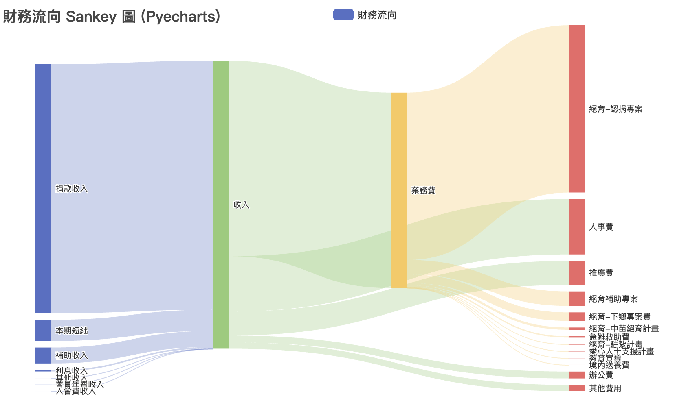

# Excel to Sankey Diagram Generator (Excel 轉 Sankey 圖表產生器)

這是一個 Python 腳本，用於讀取特定格式的 Excel 檔案，並自動產生一個互動式的 Sankey (桑基圖) 視覺化圖表 (HTML 檔案)。

本腳本使用 `pandas` 讀取 Excel 資料，並使用 `pyecharts` 產生圖表。

## 🎨 範例輸出



## 🛠️ 安裝與設定

在執行此腳本之前，您需要設定好 Python 環境並安裝必要的相依套件。

1.  **建立並啟動虛擬環境** 

      * **macOS / Linux:**
        ```bash
        # 建立
        python3 -m venv .venv
        # 啟動
        source .venv/bin/activate
        ```

2.  **安裝相依套件**

    (請確保您的虛擬環境已啟動)
    使用 `requirements.txt` 檔案來安裝所有必要的套件：

    ```bash
    pip install -r requirements.txt
    ```

## 📊 必要的 Excel 資料格式

此腳本**嚴格要求**您的 Excel 檔案 (`.xlsx`) 必須符合以下欄位結構。它會讀取 Excel 中的第一個工作表 (worksheet)。

  * **A 欄 (索引 0): `來源 (Source)`**
      * 資料流的起始節點名稱 (例如: "捐款收入")。
  * **B 欄 (索引 1): `目標 (Target)`**
      * 資料流的終點節點名稱 (例如: "收入")。
  * **E 欄 (索引 4): `數值 (Value)`**
      * 該筆資料流的金額 (例如: `9697.7`)。

**範例如下 (`data/A0226_112.xlsx`):**

| A 欄 (來源) | B 欄 (目標) | C 欄 | D 欄 | E 欄 (金額...) | F 欄 | ... |
| :--- | :--- | :--- | :--- | :--- | :--- | :--- |
| 捐款收入 | 收入 | ... | ... | 9697.7 | 1 | ... |
| 補助收入 | 收入 | ... | ... | 621.9 | 1 | ... |
| 收入 | 業務費 | ... | ... | 7610.1 | 2 | ... |
| 收入 | 人事費 | ... | ... | 2157.0 | 2 | ... |
| 業務費 | 培育-認捐專案 | ... | ... | 6516.0 | 3 | ... |

*(腳本會自動忽略 A, B, E 欄以外的欄位)*

## 🚀 如何使用

您需要透過終端機 (Terminal) 來執行此腳本，並將 Excel 檔案的路徑作為參數傳入。

(假設您的腳本名稱為 `generate_sankey.py`)

1.  啟動您的虛擬環境 (如果尚未啟動)：

    ```bash
    source .venv/bin/activate
    ```

2.  執行腳本，並傳入檔案路徑：

    ```bash
    python create_sankey.py [您的 Excel 檔案路徑]
    ```

**具體範例：**

```bash
python create_sankey.py data/A0226_112.xlsx
```

## 📂 輸出結果

腳本執行成功後：

1.  它會自動在專案根目錄建立一個 `result/` 資料夾 (如果它不存在的話)。
2.  一個新的 `.html` 檔案將被儲存在 `result/` 資料夾中。
3.  輸出的 HTML 檔名會根據您的輸入檔名自動產生 (例如: `A0226_112_sankey.html`)。

您可以直接在任何網頁瀏覽器中打開這個 HTML 檔案，以查看您的互動式 Sankey 圖表。

```
Pyecharts Sankey 圖表已成功生成！
檔案已儲存為: /.../workspace/result/A0226_112_sankey.html
```